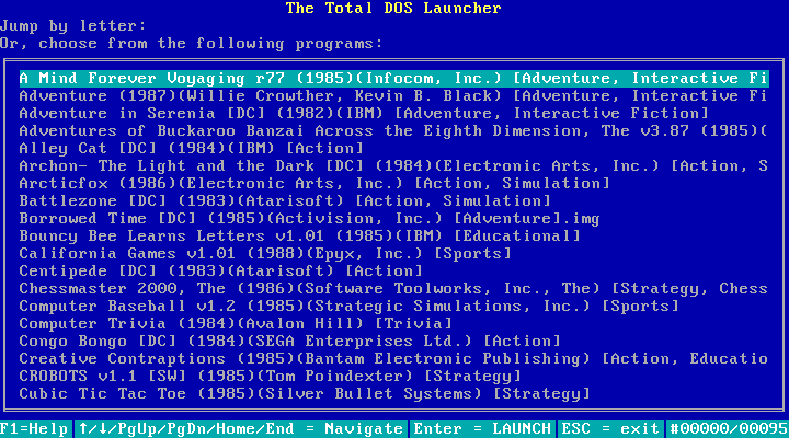

Total DOS Launcher
##################

The Total DOS Launcher is a system for easily loading and running thousands of
DOS programs on vintage hardware.  If you're familiar with vintage gaming
console "flash multicarts" that allow you to load hundreds of games onto a
single console, that's what this is:  Think of the TDL as "console multicart"
software for DOS.

In a nutshell, the TDL takes all of your zipped-up long-filename archives:

| A Mind Forever Voyaging r77 (1985)(Infocom, Inc.) [Adventure, Interactive Fiction].zip
| Adventure (1987)(Willie Crowther, Kevin B. Black) [Adventure, Interactive Fiction].zip
| Adventure in Serenia [DC] (1982)(IBM) [Adventure, Interactive Fiction].zip
| Adventures of Buckaroo Banzai Across the Eighth Dimension, The v3.87 (1985)(Adventure International) [Adventure, Interactive Fiction].zip
| Alley Cat [DC] (1984)(IBM) [Action].zip
| Archon- The Light and the Dark [DC] (1984)(Electronic Arts, Inc.) [Action, Strategy].zip
| Arcticfox (1986)(Electronic Arts, Inc.) [Action, Simulation].zip
| Battlezone [DC] (1983)(Atarisoft) [Action, Simulation].zip
| Borrowed Time [DC] (1985)(Activision, Inc.) [Adventure].img.zip
| Bouncy Bee Learns Letters v1.01 (1985)(IBM) [Educational].zip
| California Games v1.01 (1988)(Epyx, Inc.) [Sports].zip
| Centipede [DC] (1983)(Atarisoft) [Action].zip
| Chessmaster 2000, The (1986)(Software Toolworks, Inc., The) [Strategy, Chess].zip
.

...and copies them to files that can be copied over to any DOS system, even those without long-filename support::

 AMINDFOR.ZIP
 ADVENTUR.ZIP
 ADVENTUA.ZIP
 ADVENTUB.ZIP
 ALLEYCAT.ZIP
 ARCHON-T.ZIP
 ARCTICFO.ZIP
 BATTLEZO.ZIP
 BORROWED.ZIP
 BOUNCYBE.ZIP
 CALIFORN.ZIP
 CENTIPED.ZIP
 CHESSMAS.ZIP

...along with a menu program that easily launches them without requiring them to be unzipped beforehand:

It can do this with a few hundred programs, or thousands, or tens of thousands.  Your only limitation is how much storage space you have on your target DOS system.

Currently, the TDL is not ready for prime time; this paragraph will be removed when it is.  If you are testing TDL for the purpose of providing feedback, please consult "readme_a.txt" for instructions.  Also, feel free to `contribute an issue via github project. <https://github.com/MobyGamer/total-dos-launcher/issues>`

.. contents::
.. section-numbering::

Using TDL
=========

Overview
--------

The Total DOS Launcher consists of two programs:  An indexer, and a menu system.  You use the indexer to prepare your files for copying over to the vintage DOS system, and you use the menu program on the DOS system to navigate and launch the programs you copied over.

Prerequisites
-------------

Indexer:  Currently a python script, so you'll need to install python 3.6 or higher on your system if it isn't already there.  (When this project is past the beta stage, native binaries will be provided for Windows, Mac, and Linux.)

Menu program:  The menu program runs on any IBM PC or compatible running DOS 3.1 or higher, with a minimum of 256KB RAM.

Step one: The Indexer
---------------------

C:\DOS\D\PROJECTS\TDL>TDLindexer.py ..\dos_program_sources\small.generic.4example output
Gathering list of files...
Found 96 files to copy.
Converting to DOS-friendly 8.3 filenames...
Generating files index...
Generating titles index...
Copying files from ..\dos_program_sources\small.generic.4example to output ...
Done.

Step two: Copy to the vintage system
------------------------------------

x

Step three: Launch the menu program
-----------------------------------

Building TDL
============

If you'd like to work on the code and contribute back to the project, that's great -- however, be prepared to get (re)acquainted with DOS compilers and tools!

Languages
---------
TDL is written in Turbo Pascal 7.0, with a small amount of assembler thrown in
for speed or utility.  Knowledge of Pascal is require to extend TDL.

Libraries
---------
TDL is not 100% self-contained; it uses some support libraries and units to
provide functionality like CUI/TUI primitives, userspace swapping, and stream
extensions.  Ensure you have a copy of both https://github.com/MobyGamer/TPLibs
and https://github.com/MobyGamer/UNITS available in your source path.

Compilers and Tools
-------------------
Borland Pascal 7.0, which includes both Turbo Pascal as well as Turbo
Assembler/linker/debugger, is available via your favorite search engine.  A
full installation of it is rumored to be included in
ftp://ftp.oldskool.org/pub/misc/xtfiles.rar.

Compiler/Assembler restrictions
-------------------------------
You must always ensure that the code you write will execute on any x86 system,
including the 8088.  Don't use 80186+ instructions such as ``PUSHA``, ``POPA``,
``ENTER``, ``LEAVE``, etc.  In Turbo Pascal, always ensure ``$G-,N-,E-`` to
turn off 80286 code generation, 8087 code generation, and 8087 emulation
respectively.  One of TDL's design goals is the ability to work on any IBM PC
or compatible.
